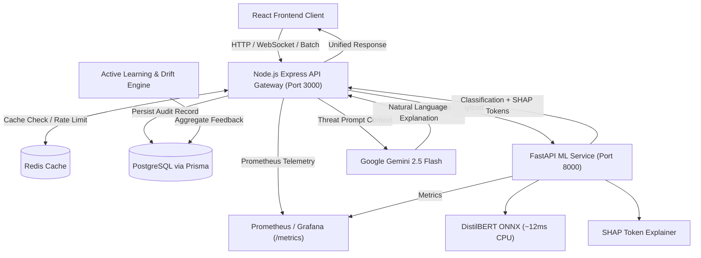

# Mail Guard AI

**Enterprise-grade email spam & cybersecurity threat defense platform with Explainable AI (XAI), ONNX Runtime inference, Gemini LLM security reasoning, and cloud-native microservices.**

[](https://github.com/Manas-Gupta16/mail-guard-ai/actions/workflows/ci.yml)
[](LICENSE)
[](https://nodejs.org/)
[](https://python.org/)
[](https://docker.com/)

---

## Overview

Traditional spam filters rely on black-box heuristics or naive Bayesian filters that are easily bypassed by obfuscated links, homograph attacks, and psychological urgency triggers.

**Mail Guard AI** is a production-grade, full-stack threat analysis system that combines:
1. **Fine-Tuned DistilBERT Transformer** for deep semantic classification.
2. **High-Performance ONNX Runtime** CPU inference (~11–14ms latency).
3. **4-Class Threat Taxonomy** (`ham`, `marketing_spam`, `phishing`, `malware_dropper`) with compound risk scoring (0–100).
4. **Explainable AI (SHAP)** token attribution to highlight exactly which words triggered flags.
5. **Lightweight LLM RAG (Google Gemini 2.5 Flash)** to produce natural language security analyst explanations.
6. **Asynchronous Batch Ingestion Pipeline** for processing 1,000+ emails in background queues.
7. **Prometheus Metrics & Active Learning Drift Monitoring** for enterprise observability.

---

## Architectural Highlights

| Dimension | Standard Portfolio Project | Mail Guard AI |
|---|---|---|
| **Model Engine** | Sklearn Logistic Regression / Naive Bayes | Fine-tuned DistilBERT with ONNX Runtime CPU graph optimizations |
| **Threat Granularity** | Binary (Spam / Ham) | 4-Class Taxonomy (`ham`, `marketing_spam`, `phishing`, `malware_dropper`) |
| **Explainability** | Black box | Token-level SHAP attribution + Gemini 2.5 LLM threat reasoning |
| **Backend Architecture** | Monolithic Flask script | Express.js API Gateway + FastAPI ML Service with zero-downtime DB fallback |
| **Bulk Processing** | Sequential blocking requests | Asynchronous chunked batch queue (`/api/v1/batch`) with progress polling |
| **Observability** | Print statements | Standard Prometheus `/metrics` scraping, Pino structured logs, correlation IDs |
| **Continuous Learning** | Static model | Human-in-the-loop active learning loop with live drift detection |
| **Infrastructure** | Localhost only | Multi-stage Dockerfiles, Docker Compose, GitHub Actions CI/CD automation |

---

## System Architecture



---

## Core Capabilities

### 1. 4-Class Threat Taxonomy & Compound Risk Scoring
Every email is evaluated across deep semantic layers and structural heuristic extractors:
- **`ham`**: Benign personal and enterprise communications (`riskScore`: 0–24, `LOW`).
- **`marketing_spam`**: Commercial mass marketing, promotional newsletters, and discount offers (`riskScore`: 25–60, `MEDIUM`).
- **`phishing`**: Credential harvesting, urgent account suspension threats, and disguised login URLs (`riskScore`: 61–85, `HIGH`).
- **`malware_dropper`**: Suspicious script payloads, dangerous attachments (`.exe`, `.iso`, `.zip`, `.scr`), and macro execution triggers (`riskScore`: 86–100, `CRITICAL`).

### 2. Explainable AI (SHAP) & LLM Reasoning (Gemini 2.5 Flash)
- **Token Attribution (SHAP)**: Calculates Shapley values for each word. Positive scores push toward spam (`"Verify"`, `"+0.091"`, `"funds"`, `"+0.042"`), while negative scores push toward legitimate context (`"meeting"`, `"-0.052"`).
- **Gemini Threat Briefing**: Synthesizes token attributions and structural features into an actionable 2-3 sentence security analyst briefing.

### 3. Asynchronous Batch Ingestion Pipeline
- **`POST /api/v1/batch`**: Accepts bulk email payloads (up to 1,000+ items), returning `202 Accepted` with a tracking `jobId`.
- **`GET /api/v1/batch/:jobId`**: Real-time progress polling (0%–100%), processing speed (emails/sec), threat distribution breakdown, and high-risk flagged items.
- **`GET /api/v1/batch/:jobId/download`**: Exportable JSON scan report.

### 4. Prometheus Metrics & Observability
Standard Prometheus metrics exposed at `/metrics`:
- `mailguard_http_requests_total{method, route, status_code}`
- `mailguard_http_request_duration_seconds` (latency histogram)
- `mailguard_predictions_total{label, threat_type, risk_level}`
- `mailguard_prediction_latency_ms` (gauge)
- `mailguard_risk_score_distribution` (histogram)
- `mailguard_active_ws_connections` (gauge)
- `mailguard_batch_jobs_total{status}`

### 5. Active Learning & Model Drift Engine
- **Human-in-the-Loop Feedback**: Users submit corrections on predictions.
- **`GET /api/v1/retrain/drift`**: Evaluates model disagreement rates and high-uncertainty samples (confidence 0.40–0.65) to compute a live drift status (`HEALTHY`, `MONITOR`, `RETRAINING_RECOMMENDED`).
- **`POST /api/v1/retrain/export`**: Exports fine-tuning training manifests (`manifest.jsonl`) for automated retraining.

---

## Tech Stack

| Layer | Technology | Key Details |
|---|---|---|
| **ML Engine** | DistilBERT (`distilbert-base-uncased`) | Fine-tuned on 40,000+ email corpus (98.8% accuracy) |
| **Inference** | ONNX Runtime | Optimized graph execution on CPU (~11–14ms) |
| **Explainability** | SHAP (Kernel SHAP) | Cooperative game-theoretic token attributions |
| **LLM RAG** | Google Gemini 2.5 Flash | Context-aware natural language threat analysis |
| **ML Microservice** | FastAPI + Uvicorn | High-performance asynchronous Python API |
| **API Gateway** | Express.js + WebSocket (`ws`) | REST, WebSocket streaming, and batch orchestration |
| **Database** | PostgreSQL + Prisma ORM | Predictions, human feedback, API keys (with offline fallback) |
| **Cache & Rate Limit**| Redis (`ioredis`) | SHA-256 content caching + sliding window rate limiter |
| **Observability** | Prometheus (`prom-client`) + Pino | Standard metrics scraping & structured JSON logging |
| **Validation** | Zod | Runtime schema validation & sanitized payloads |
| **Testing** | Pytest + Jest + Supertest | 41/41 unit & integration test coverage |
| **DevOps & CI/CD** | Docker Compose + GitHub Actions | Automated linting, test suites, and container builds |

---

## Project Structure

```
mail-guard-api/
├── .github/workflows/          # CI/CD pipelines (Ruff, Pytest, Jest, Docker)
│   └── ci.yml
├── packages/
│   ├── ml-service/             # Python ML microservice
│   │   ├── src/
│   │   │   ├── api/            # FastAPI endpoints & /metrics
│   │   │   ├── models/         # ONNX DistilBERT & 4-class taxonomy
│   │   │   ├── explainers/     # SHAP token attribution
│   │   │   ├── features/       # Threat signature & URL feature extractor
│   │   │   └── training/       # Active learning & drift engine
│   │   ├── tests/              # Pytest test suite (29 tests)
│   │   ├── Dockerfile
│   │   └── pyproject.toml
│   ├── api-server/             # Node.js API Gateway
│   │   ├── src/
│   │   │   ├── routes/         # /classify, /batch, /feedback, /retrain, /metrics
│   │   │   ├── middleware/     # Auth, rate limiting, validation, logging
│   │   │   ├── services/       # ML service client, Gemini RAG, batch worker
│   │   │   ├── websocket/      # Real-time WebSocket streaming
│   │   │   └── db/             # Prisma schema & PostgreSQL client
│   │   ├── tests/              # Jest integration test suite (12 tests)
│   │   ├── Dockerfile
│   │   └── package.json
│   └── web-client/             # React frontend client
├── infra/
│   └── docker-compose.yml      # Multi-container local stack
└── README.md
```

---

## Quick Start

### 1. Prerequisites
- [Node.js](https://nodejs.org/) (v20+)
- [Python](https://python.org/) (v3.11+)
- [Docker & Docker Compose](https://www.docker.com/)

### 2. Environment Setup
```bash
# Clone the repository
git clone https://github.com/Manas-Gupta16/mail-guard-ai.git
cd mail-guard-ai

# Copy environment template
cp .env.example .env
# Add your GEMINI_API_KEY in .env (obtain free from https://aistudio.google.com)
```

### 3. Running with Docker Compose
```bash
docker-compose -f infra/docker-compose.yml up --build
```

| Service | Port | Endpoint |
|---|---|---|
| **API Gateway** | `3000` | `http://localhost:3000` |
| **ML Microservice** | `8000` | `http://localhost:8000` |
| **Prometheus Metrics** | `3000` | `http://localhost:3000/metrics` |
| **Health Check** | `3000` | `http://localhost:3000/api/v1/health` |

### 4. Running Locally (Without Docker)

**ML Service (Terminal 1):**
```bash
cd packages/ml-service
pip install -e ".[dev]"
uvicorn src.api.main:app --reload --port 8000
```

**API Gateway (Terminal 2):**
```bash
cd packages/api-server
npm install
npm run db:generate
npm start
```

---

## API Reference

### POST `/api/v1/classify`
Classify an email with multi-class taxonomy, SHAP token attribution, and Gemini reasoning.

```bash
curl -X POST http://localhost:3000/api/v1/classify \
  -H "Content-Type: application/json" \
  -d '{
    "text": "FINAL WARNING: Your account is suspended. Verify identity immediately at http://bit.ly/update-sec",
    "includeShap": true,
    "includeExplanation": true
  }'
```

**Response:**
```json
{
  "id": "req_cuid12345",
  "label": "spam",
  "confidence": 0.9909,
  "threatType": "phishing",
  "riskScore": 88.5,
  "riskLevel": "CRITICAL",
  "probabilities": {
    "ham": 0.0091,
    "marketing_spam": 0.0812,
    "phishing": 0.8924,
    "malware_dropper": 0.0173
  },
  "shapTokens": [
    { "token": "http", "score": 0.0999 },
    { "token": "update", "score": 0.0914 },
    { "token": "Verify", "score": 0.0409 },
    { "token": "FINAL", "score": 0.0164 }
  ],
  "features": {
    "url_count": 1,
    "has_shortened_urls": true,
    "urgency_score": 0.67,
    "caps_ratio": 0.0994
  },
  "explanation": "This email was classified as phishing with 99.1% confidence due to strong credential harvesting keywords and high urgency language combined with an obfuscated bit.ly link masking the true destination.",
  "modelVersion": "2.0.0",
  "inferenceTimeMs": 14,
  "cached": false,
  "timestamp": "2026-08-08T16:00:00.000Z"
}
```

### POST `/api/v1/batch`
Submit a bulk batch of emails for background asynchronous processing.

```bash
curl -X POST http://localhost:3000/api/v1/batch \
  -H "Content-Type: application/json" \
  -d '{
    "items": [
      "Meeting agenda for Tuesday project review",
      "FINAL WARNING: Your account is suspended. Verify immediately at http://bit.ly/sec"
    ]
  }'
```

**Response (202 Accepted):**
```json
{
  "message": "Batch job accepted for processing",
  "jobId": "batch_abc123xyz789",
  "totalItems": 2,
  "statusUrl": "/api/v1/batch/batch_abc123xyz789"
}
```

### GET `/api/v1/retrain/drift`
Live model drift monitoring and human feedback agreement rate.

```bash
curl http://localhost:3000/api/v1/retrain/drift
```

---

## Testing & Quality Assurance

Both microservices include automated unit and integration test suites:

```bash
# Run ML microservice tests (29 tests)
cd packages/ml-service
pytest

# Run API Gateway integration tests (12 tests)
cd packages/api-server
npm test
```

---

## License

This project is licensed under the MIT License. See [LICENSE](LICENSE) for details.
